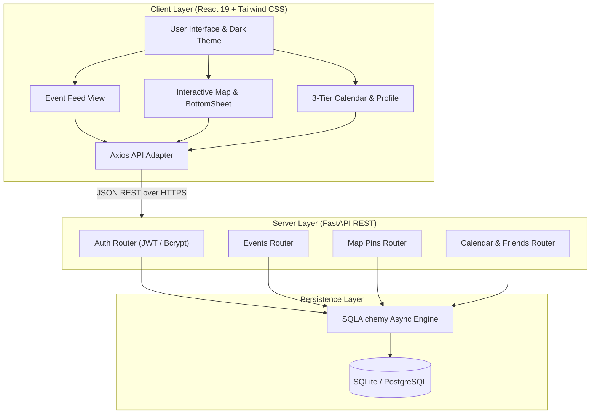

# System Architecture

## Architecture Overview

CampusPulse is engineered as a decoupled modern web application with high performance, visual richness, and strict privacy controls.

---

## Key Design Patterns
1. **Repository & Router Pattern**: Decouples API endpoints from database models.
2. **Adapter Pattern**: In `code/src/api.js`, dynamic fallbacks route requests to mock dataset when server is offline.
3. **Optimistic UI Updates**: State mutations reflect instantly in the interface before backend persistence completes.
4. **Role-Based Access Control (RBAC)**: Fine-grained permissions distinguishing regular students, society coordinators, and administrators.
