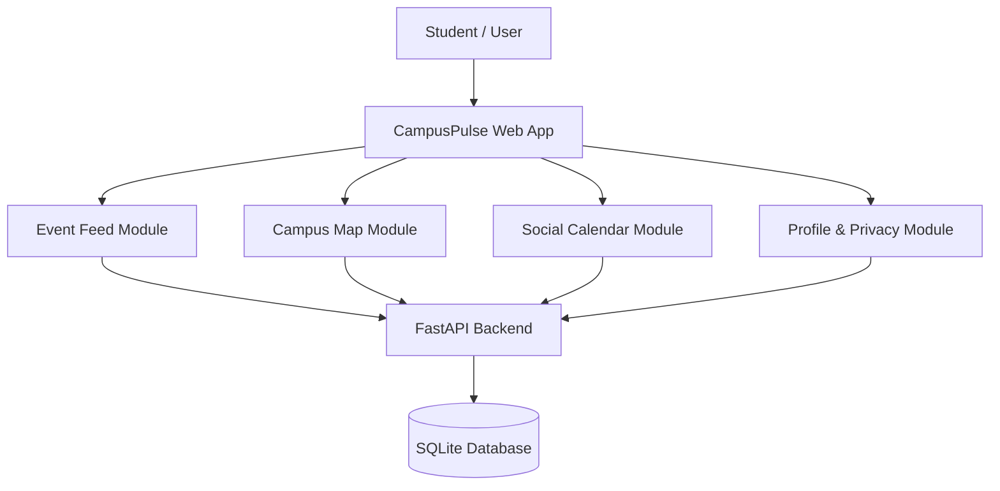

# Project Overview: CampusPulse

## 1. System Vision
CampusPulse is envisioned as an all-in-one digital companion for campus life at Thapar Institute. It bridges the gap between campus administration/societies and students by unifying events, navigation, and peer schedules in a single responsive web application.

---

## 2. Core Functional Modules

### 2.1 Society & Event Feed
- Real-time display of campus events and announcements.
- Dynamic filtering pills: `All`, `Tech`, `Cultural`, `Sports`, `Hackathons`, `Free Food`, `Cash Prize`.
- One-click RSVP and Save-to-Calendar actions.

### 2.2 Interactive Campus Map
- OpenStreetMap and CARTO tiles centered precisely on Thapar University (Patiala, Punjab).
- Custom animated markers for Academic Blocks, Hostels, Auditoriums, Sports Complex, and Cafeterias.
- Apple Maps-style draggable Bottom Sheet displaying venue descriptions, walking directions, and ongoing events.

### 2.3 3-Tier Privacy Calendar
- **Public**: Any logged-in campus student can view attending events.
- **Friends Only**: Only mutual followers/friends can view schedule details.
- **Private**: Hidden from everyone; personal schedule only.

### 2.4 Profile & Auth Hub
- JWT-based authentication with bcrypt password security.
- Personal dashboard displaying saved events, society affiliations, and upcoming schedules.

---

## 3. Architectural Highlights
- **Single Page Application (SPA)**: Built with React 19 for instantaneous sub-millisecond tab switching without full-page reloads.
- **Async Python Backend**: FastAPI handles high concurrent read/write loads with minimal CPU overhead.
- **Optimized Bundle**: Rollup code splitting creates separate lightweight chunks for map, motion, icons, and UI components.
