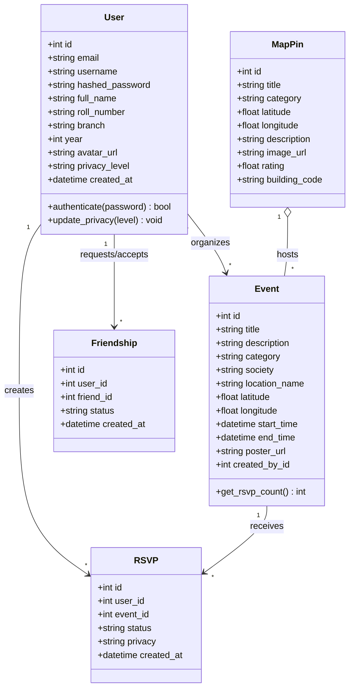
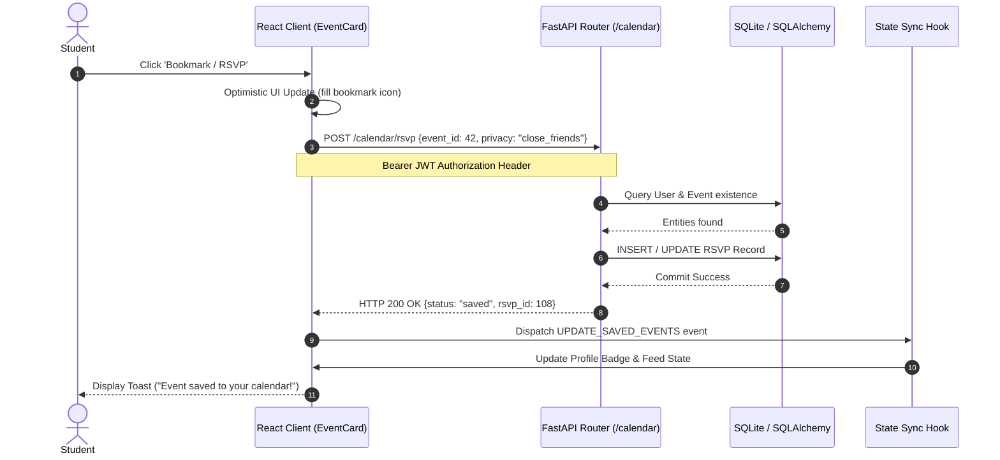
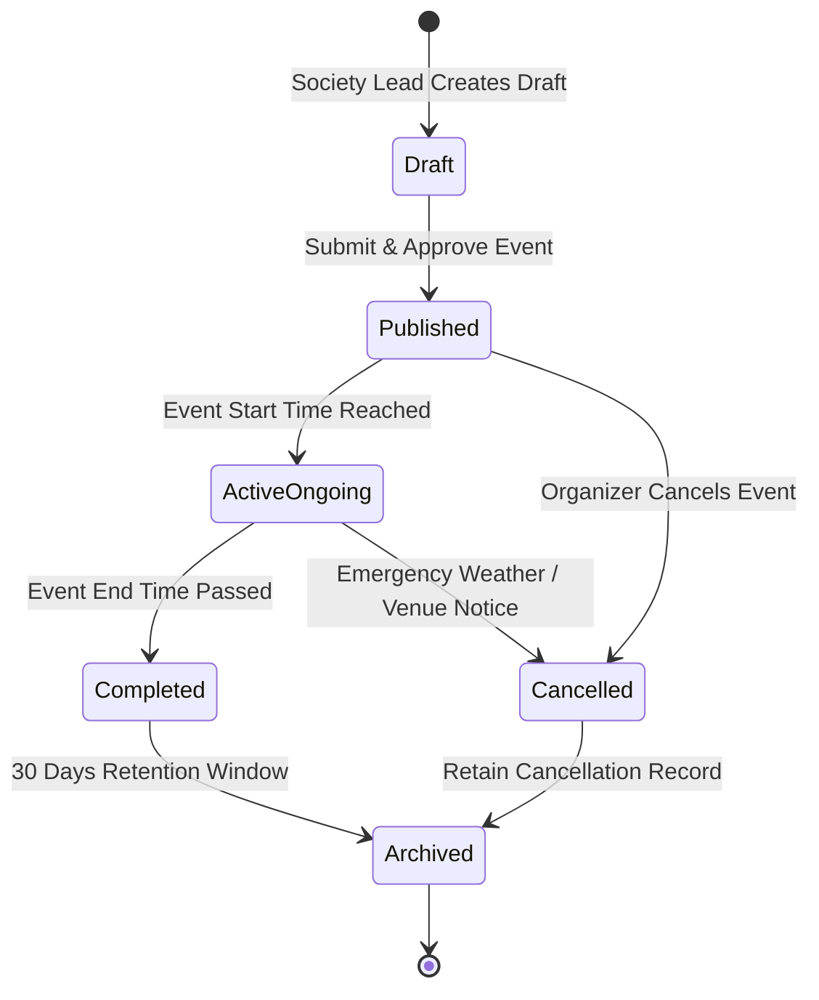

# UML Structural & Behavioral Diagrams

## 1. Class Diagram



---

## 2. Sequence Diagram: Event RSVP & Notification



---

## 3. Collaboration / Communication Diagram

```mermaid
graph LR
    U((Student)) -->|1: tapMapMarker()| C[MapView Component]
    C -->|2: selectPin(pinId)| S[State Controller]
    S -->|3: fetchPinDetails(pinId)| API[REST API Client]
    API -->|4: GET /api/map_pins/{id}| SVR[FastAPI Server]
    SVR -->|5: SELECT * FROM map_pins WHERE id=?| DB[(SQLite Database)]
    DB -.->|6: Pin Entity Data| SVR
    SVR -.->|7: JSON Response| API
    API -.->|8: Pin Payload| S
    S -->|9: setDrawerState('half')| D[BottomSheet Component]
    D -->|10: renderVenueCard()| U
```

---

## 4. State Chart Diagram: Event Lifecycle


