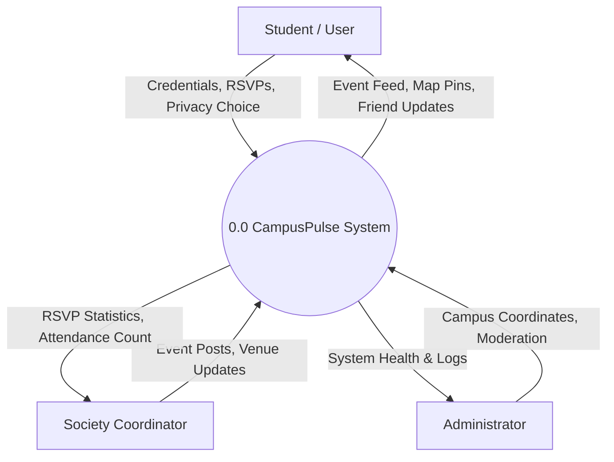
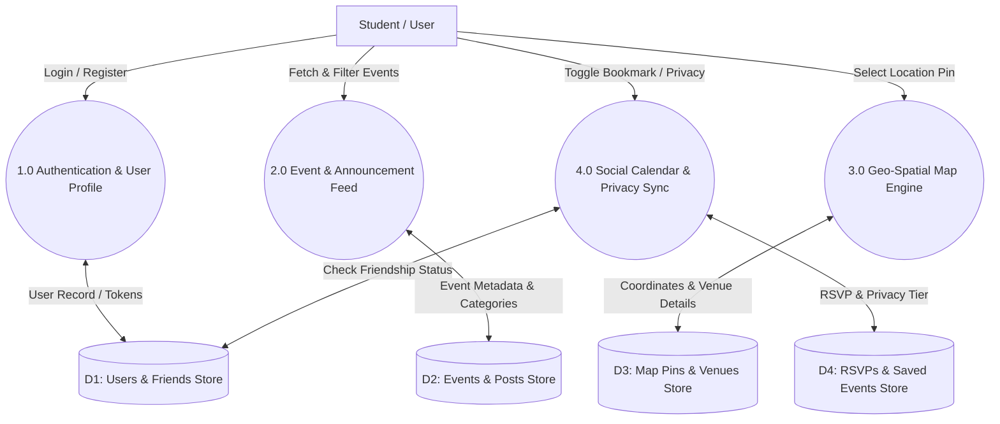
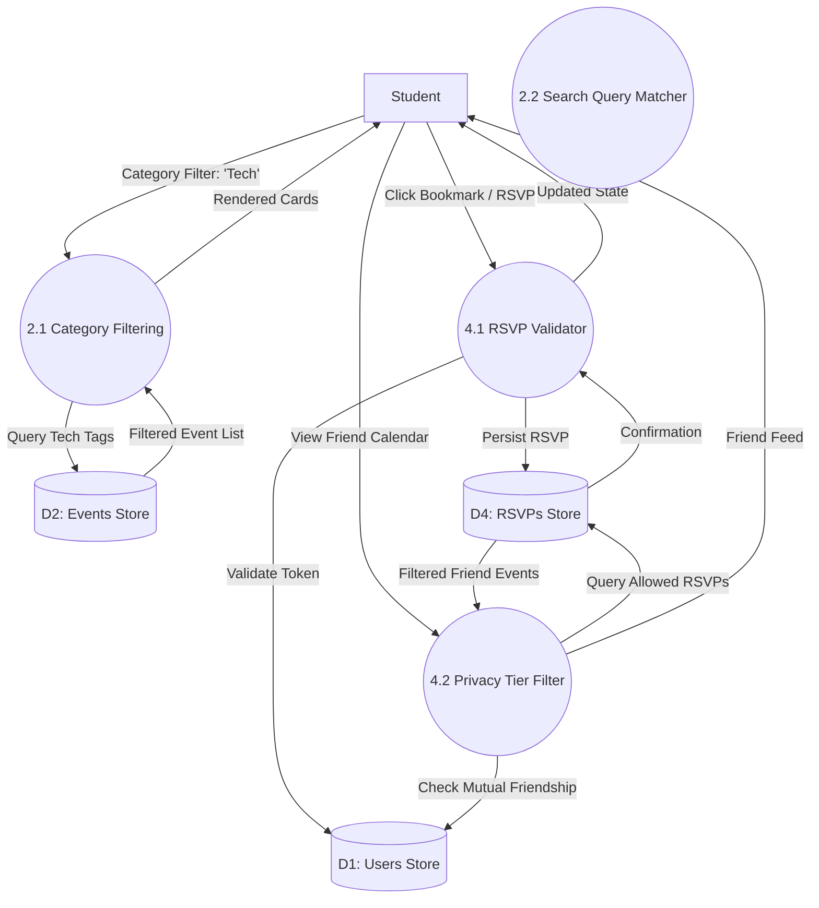

# Data Flow Diagrams (DFD Levels 0, 1, 2)

## 1. DFD Level 0 — Context Level Diagram

The Level 0 Context Diagram establishes the boundary between CampusPulse and external entities.

---

## 2. DFD Level 1 — Subsystem Data Flow

Decomposition of CampusPulse into core functional sub-processes and data stores.

---

## 3. DFD Level 2 — Event & RSVP Detailed Flow (Process 2.0 & 4.0)

