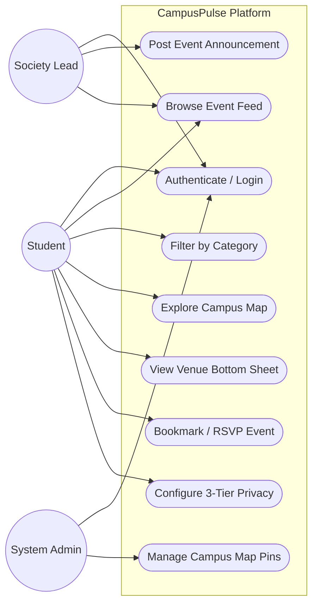

# Use-Case Diagrams & Specifications

## 1. System Use-Case Diagram

---

## 2. Detailed Use-Case Specifications

### Use-Case UC-05: View Venue Bottom Sheet
- **Primary Actor**: Student
- **Preconditions**: User has navigated to the Map View.
- **Trigger**: User clicks on a campus location marker (e.g. TAN Auditorium, Library).
- **Main Success Scenario**:
  1. System highlights the clicked marker with a pulsing cyan border.
  2. System animates the Apple Maps-style Bottom Sheet into half-expanded view.
  3. System renders venue photograph, aggregate student rating, description, and list of ongoing/upcoming events.
  4. User can swipe up to expand full details or swipe down to dismiss.
- **Postconditions**: Map view remains active in the background.

---

### Use-Case UC-07: Configure 3-Tier Calendar Privacy
- **Primary Actor**: Student
- **Preconditions**: Student is authenticated and viewing their Profile.
- **Trigger**: Student selects one of `Public`, `Close Friends`, or `Private`.
- **Main Success Scenario**:
  1. Student selects desired privacy level radio button.
  2. Frontend sends updated preferences to backend API (`PATCH /auth/me`).
  3. Backend updates `privacy_level` in SQLite database.
  4. System confirms with a success alert badge.
- **Postconditions**: Friends querying the student's schedule are filtered based on the new privacy tier.
